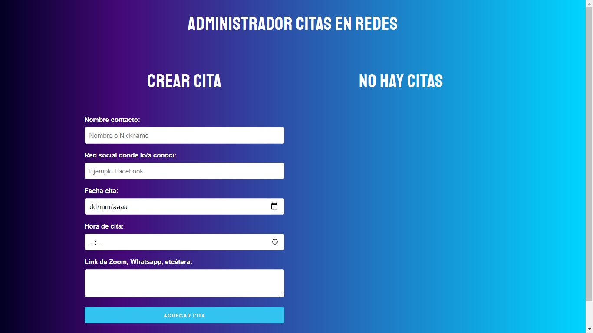
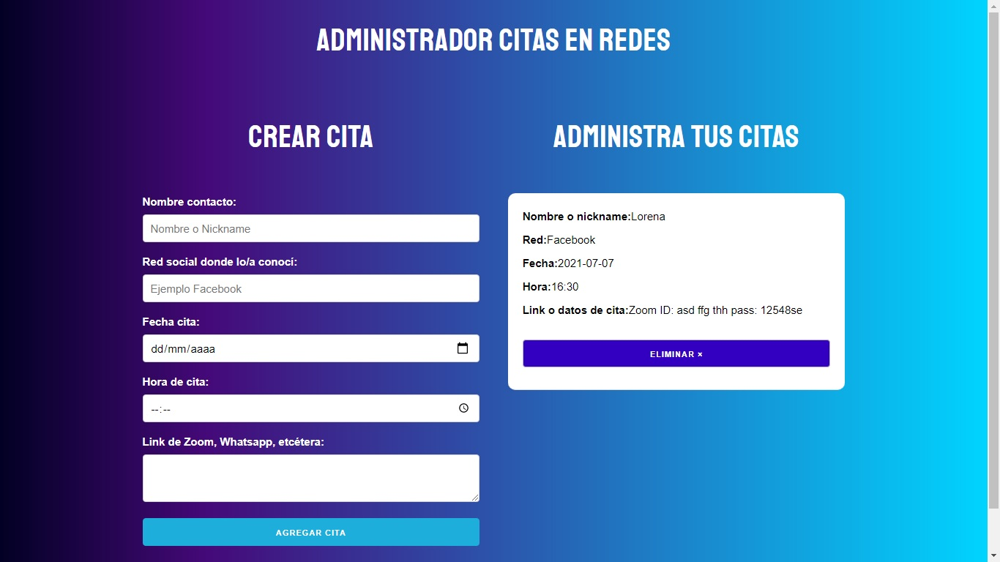

# App de citas en React

La app guarda las citas en Local Storage,  lo que significa que si salen de la app, o si apagan la computadora, incluso en el celular, las citas van a estar ahí guardadas.

## Link: https://alexx-app-de-citas-react.netlify.app/

Codeado por Alejandro G Vera
